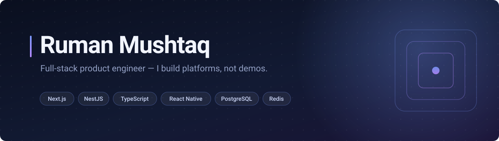
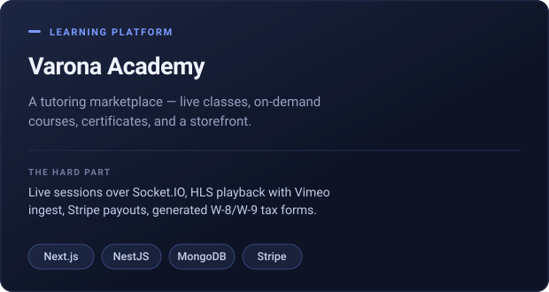
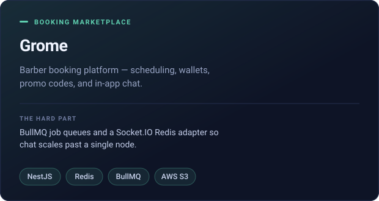
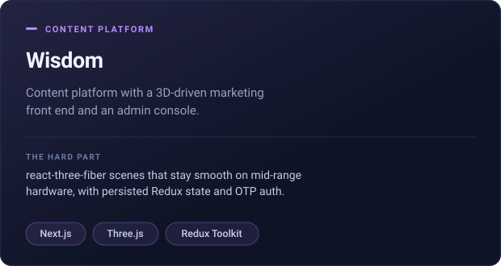
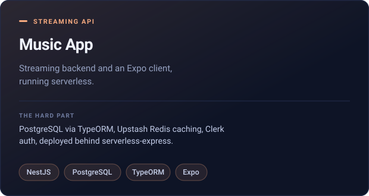

 

<table>
  <tr>
    <td width="50%">
      
    </td>
    <td width="50%">
      
    </td>
  </tr>
  <tr>
    <td width="50%">
      
    </td>
    <td width="50%">
      
    </td>
  </tr>
</table>

 

### Stack

**Frontend** &nbsp;·&nbsp; TypeScript · Next.js · React · Tailwind · Radix UI · Zustand · Redux Toolkit · TanStack Query · React Hook Form + Zod · Framer Motion

**Backend** &nbsp;·&nbsp; NestJS · Node.js · REST + Swagger · Socket.IO · Passport/JWT · BullMQ · 2FA (TOTP)

**Data** &nbsp;·&nbsp; MongoDB / Mongoose · PostgreSQL / TypeORM · Redis

**Mobile** &nbsp;·&nbsp; React Native · Expo Router · NativeWind · Reanimated

**Platform** &nbsp;·&nbsp; AWS S3 · Stripe · SendGrid · Firebase · ImageKit · Clerk · Vercel

 

### How I work

- **Typed end to end.** Zod schemas on the client, `class-validator` DTOs on the server, shared contracts wherever a monorepo allows it.
- **Security ships with v1.** Helmet, rate limiting, throttling and hashed credentials are not a later ticket.
- **Design systems over one-off screens.** Atomic component layers and design tokens, so the tenth screen costs less than the first.

 

### Currently

Building an AI-assisted business operating system — a monorepo with shared design tokens, typed contracts and a backend-for-frontend layer serving web, admin and mobile from one source of truth.

**Open to full-stack and frontend roles.** &nbsp;·&nbsp; [rumanm.dev@gmail.com](mailto:rumanm.dev@gmail.com)
